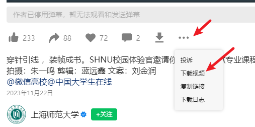
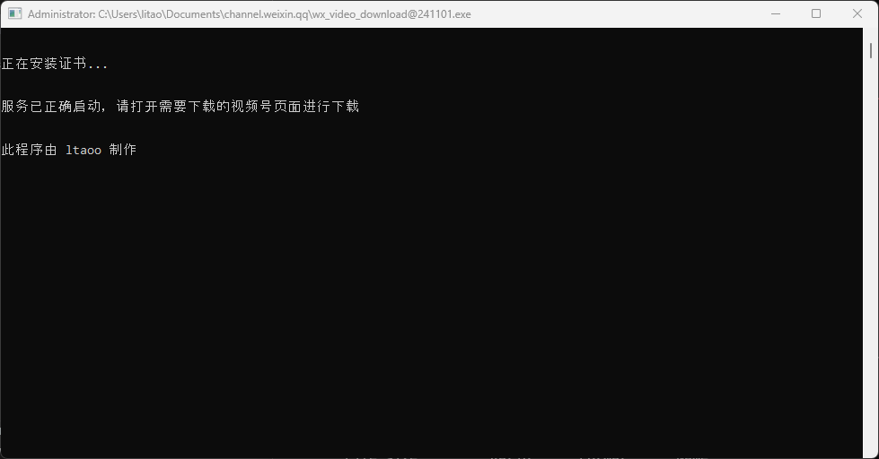

# 微信视频号下载器

体积小、使用简单、支持 macOS 和 Windows 系统。

## 251027 更新

1、优化了文件大小，现在只有8MB了
<br/>
2、`download` 命令默认多线程下载
<br/>
3、直播详情页增加了下载按钮
<br/>
4、默认下载原始规格的视频


<details><summary>点击查看更多更新内容</summary>

## 250913 更新

1、视频号首页增加下载按钮
<br/>
2、增加 `uninstall` 命令，可卸载本工具安装的根证书
<br/>
3、修复打开长视频页面空白的问题


## 250808 更新

1、修复了微信新版本没有下载按钮的问题


## 250621 更新

1、优化下载时的「进度」展示效果
<br/>
2、增加 `download` 命令，可在终端下载视频及解密。超过 1G 的视频建议使用该方式下载
<br/>

```bash
# 使用方式
./wx_video_download_xx download --url "视频地址" --key 解密key --filename "文件名"
# 视频地址、文件名参数需要双引号包裹。解密key不用双引号
# 将会下载视频到 `Downloads` 目录，然后解密
```

3、视频号「更多」菜单中增加「打印下载命令」按钮
<br/>
4、修复安装证书时有些错误提示不是中文的问题


## 250514 更新

1、修复无法下载图片视频的问题

## 25042501 更新

1、修复了下载的视频无法播放的问题

## 250425 更新

1、修复了无法下载视频的问题

## 250424 更新

1、修复了 下载按钮样式不一致的问题
<br/>
2、修复了 更多按钮点击不显示更多菜单的问题
<br/>
3、增加了 windows 启动失败时提示是否以管理员身份运行

## 250215 更新

1、在控制台显示下载进度，当获取不到进度时显示已下载的字节数
<br/>
2、在「更多」菜单中增加封面图片下载
<br/>
3、自动检测当前网络设备并代理
<br/>
4、支持命令行参数指定要代理的网络设备和程序使用的端口号

```bash
./wx_video_download_xxx --dev=Wi-Fi --port=1080
```

> 一般情况下无需手动指定设备与端口号，直接 ./wx_video_download_xxx 即可

## 241216 更新

1、支持下载直播回放
<br/>
2、支持 macOS 系统
<br/>
在微信 Version 3.8.9 (28564) 测试可用

macOS 下使用说明

```bash
chmod +x ./wx_video_download_darwin_xxx
sudo ./wx_video_download_darwin_xxx
```

此时会提示文件不能打开，需要到系统设置中允许，然后重新执行 `sudo ./wx_video_download_darwin_xxx`。
<br/>

在安装证书的过程中会申请权限，同意即可。后续打开无需使用 `sudo`，只需要双击运行
<br/>

关闭 `macOS` 终端时请使用 `Command + c` 的方式，否则可能会出现系统代理未取消，导致网络无法访问的问题
<br/>

> 当出现网络无法访问时请检查系统代理并手动取消即可。

<br/>

## 241106 更新

1、修复了 非首次打开的视频，下载下来都无法播放的问题

现在点击页面上「更多推荐」视频，下载下来的视频可以正常打开播放了。
<br>
当出现「解密失败，停止下载」的提示，关闭全部视频页面、窗口。重新打开，就可以下载。

## 241104 更新

1、 支持下载不同质量的视频
<br>
2、 修复了下载的视频无法拖动进度条的问题
<br>
3、 修复了长视频内容进度未加载就下载，导致视频无法播放或不完整的问题
<br>
4、 修复了某些视频误判断为图片导致无法下载的问题
<br>
5、 修复了直播间一直加载中的问题


关于不同质量的视频，详情见下方使用说明。

## 241102 更新

在「更多」下拉菜单增加「下载视频」按钮，兼容不同详情页布局不同导致没有下载按钮的问题。



## 241101 更新

现在无需手动下载证书并安装了。
<br>
修复了下载时提示找不到 `lib/jszip.min.js` 的问题。

## 241031 更新

又遇到之前无法在页面下载的问题，这次改成了下载压缩包，视频在压缩包内的形式。
目前是可行的，但无法保证之后仍然可行。

建议使用 [WechatVideoSniffer2.0](https://github.com/kanadeblisst00/WechatVideoSniffer2.0) 稳定性更高。

## 241030 更新

当视频号内容是多张图片时，也会出现下载按钮。点击将会下载一个包含了全部图片的压缩包。

## 241022 更新

当视频被删除时没有正确地显示「被删除」而是一直处于加载中状态。
下载按钮修改成和其他操作按钮相同的样式。

## 241016 更新

前一个版本又下载不了，改回在页面直接下载又正常了，是和微信客户端版本有关吗，对这块不了解。
如果 241016 这个版本用不了，可以试试其他版本。
我目前微信客户端版本是 `Weixin 3.9.12.17`，可以正常下载的。

## 241011 更新

应该是视频号又改版了，不能直接在页面下载了。改成点击下载按钮复制视频链接到粘贴板，然后到谷歌或其他浏览器打开下载。
另外测试了很多视频都可以直接下载，没有加密了。所以如果有加密视频，新版本可能会下载失败。

> 在页面直接下载，理论上还是能实现，实现上要麻烦许多，后面再研究。

</details>

## 使用说明

下载[二进制文件](https://github.com/ltaoo/wx_channels_download/releases)，**以管理员身份运行**，首次打开会自动安装证书，然后启动服务。

当终端提示「服务已正确启动」就说明可以使用了。



> 已安装证书会跳过安装证书步骤。

打开微信 PC 端，点击需要下载的视频，在视频下方的操作按钮一栏，会多出一个下载按钮，如下所示


> 如果没有，可以看看「更多」这里是否有「下载视频」按钮。<br> > 

等待视频开始播放，然后暂停视频，点击下载按扭即可下载视频。下载成功后，会在上方显示已下载的文件，下载文件名最后面会标志该视频质量。


默认会下载原始视频。点开更多，可以下载其他质量的视频（xWT111、xWT126 等）。


<br>

不同视频这里显示的选项是不同的，没有找到对 xWT111 具体的说明，属于什么分辨率、尺寸多大等等。
<br>
经过测试，如果原始视频有 104MB，这里尺寸最大的是 xWT111 为 17MB，最小的是 xWT98 为 7MB。


仅供参考。

## 常见问题

1、服务启动了，打开视频详情后一直在加载，而且终端没有日志信息。
<br>
尝试在终端 `Ctrl+C`，按一次即可。

2、解密失败，停止下载
<br>
关闭全部视频页面、窗口。重新打开，就可以下载。

## 开发说明

先以 管理员身份 启动终端，然后 `go run main.go` 即可。

## 打包

# windows

```bash
go build -ldflags="-s -w"
```

打包后可以使用 `upx` 压缩，进一步减小体积

```bash
upx wx_channel
```

# macOS

```bash
CGO_ENABLED=1 GOOS=darwin SDKROOT=$(xcrun --sdk macosx --show-sdk-path) go build -trimpath -ldflags="-s -w" -o wx_video_download
```

```bash
CGO_ENABLED=1 GOOS=darwin GOARCH=amd64 SDKROOT=$(xcrun --sdk macosx --show-sdk-path) go build -trimpath -ldflags="-s -w" -o wx_video_download
```

## 其他

此程序大部分参考自以下项目代码
<br>
https://github.com/kanadeblisst00/WechatVideoSniffer2.0

此程序的核心实现依赖以下库
<br>
https://github.com/qtgolang/SunnyNet

## 我的赞赏码

如果我的项目对你有所帮助，可以请我喝杯咖啡 ☕️

[](https://sponsorkit-iota.vercel.app/api/sponsors)

```text
                 本项目为开源项目
            仅用于技术交流学习和研究的目的
          请遵守法律法规,请勿用作任何非法用途
               否则造成一切后果自负
           若您下载并使用即视为您知晓并同意
```
