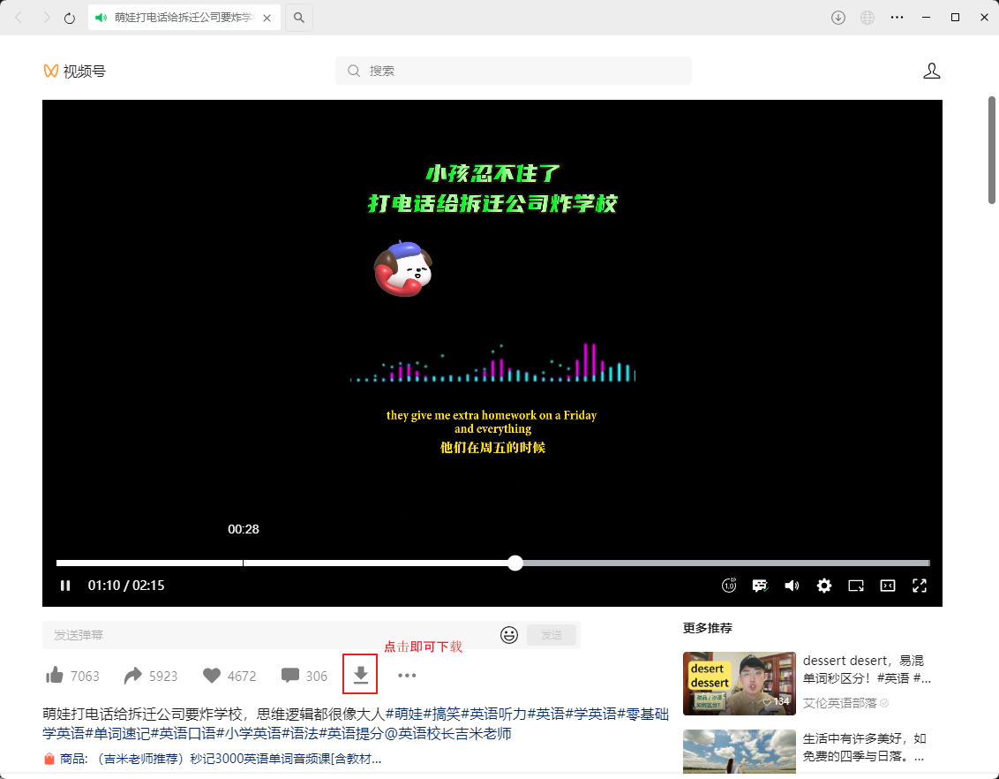
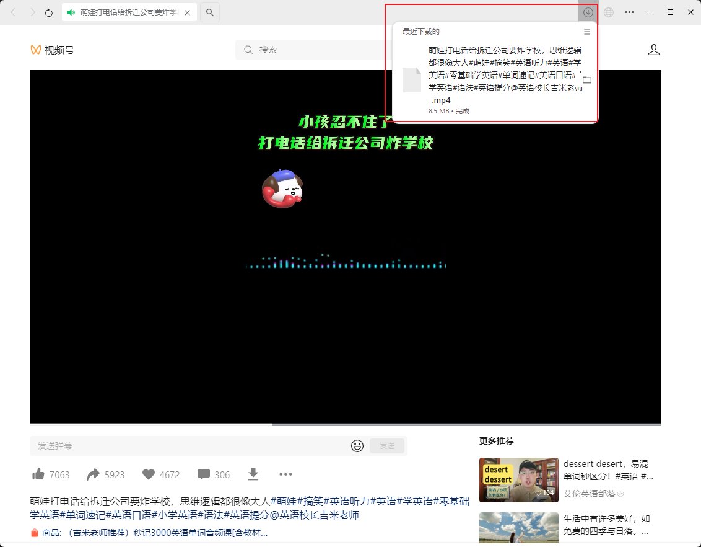
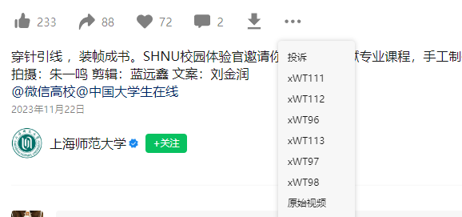
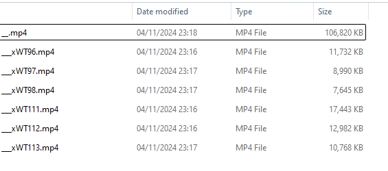

# 微信视频号下载器

体积小、使用简单、支持 macOS 和 Windows 系统。

## 使用说明

下载[构建包](https://github.com/ltaoo/wx_channels_download/releases)，**以管理员身份运行**，首次打开会自动安装证书，然后启动服务。

当终端提示「服务已正确启动」就说明可以使用了。


> 已安装证书会跳过安装证书步骤。

打开微信 PC 端，点击需要下载的视频，在视频下方的操作按钮一栏，会多出一个下载按钮，如下所示



> 如果没有，可以看看「更多」这里是否有「下载视频」按钮。<br/> 

等待视频开始播放，然后暂停视频，点击下载按扭即可下载视频。下载成功后，会在上方显示已下载的文件，下载文件名最后面会标志该视频质量。



默认会下载下拉菜单中第一个质量视频。点开更多，可以下载其他质量的视频，包括原始视频。


<br>

不同视频这里显示的选项是不同的，没有找到对 xWT111 具体的说明，属于什么分辨率、尺寸多大等等。
<br>
经过测试，如果原始视频有 104MB，这里尺寸最大的是 xWT111 为 17MB，最小的是 xWT98 为 7MB。



仅供参考。


## 开发说明

先以 管理员身份 启动终端，然后 `go run main.go` 即可。

## 打包

### windows

```bash
go build -ldflags="-s -w"
```

打包后可以使用 `upx` 压缩，进一步减小体积

```bash
upx wx_channel
```

### macOS

```bash
CGO_ENABLED=1 GOOS=darwin SDKROOT=$(xcrun --sdk macosx --show-sdk-path) go build -trimpath -ldflags="-s -w" -o wx_video_download
```

```bash
CGO_ENABLED=1 GOOS=darwin GOARCH=amd64 SDKROOT=$(xcrun --sdk macosx --show-sdk-path) go build -trimpath -ldflags="-s -w" -o wx_video_download
```

## 感谢

前端解密部分参考自
<br>
https://github.com/kanadeblisst00/WechatVideoSniffer2.0
<br>

后端解密代码来自
<br>
https://github.com/Hanson/WechatSphDecrypt


## ⚠️ 免责声明

```text
本项目为开源项目
仅用于技术交流学习和研究的目的
请遵守法律法规,请勿用作任何非法用途
否则造成一切后果自负
若您下载并使用即视为您知晓并同意
```
