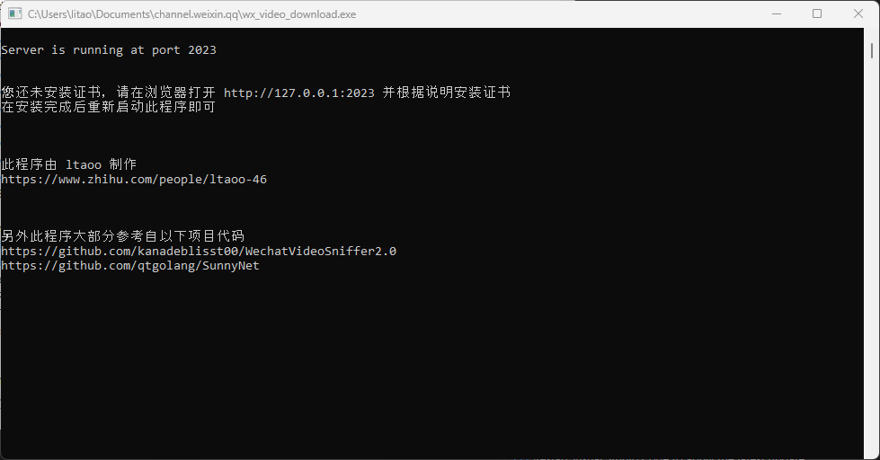
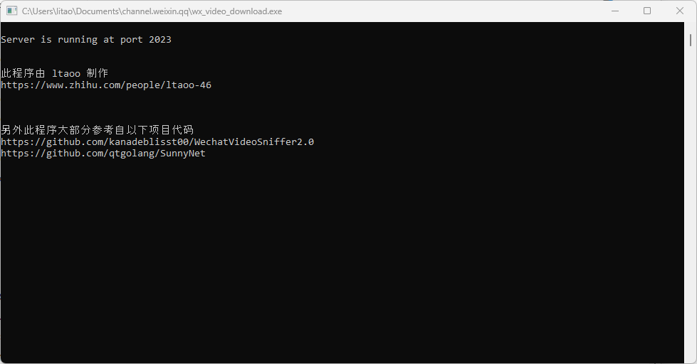

# 微信视频号下载器

又是一个轮子，不过用起来更简单些。

## 使用说明

下载二进制文件，「以管理员身份运行」。

第一次运行会提示 「您还未安装证书，请在浏览器打开 http://127.0.0.1:2023 并根据说明安装证书」

根据提示在浏览器打开 http://127.0.0.1:2023，会出现如下页面

点击页面上「SunnyRoot 证书」会自动下载证书文件。下载成功后，双击安装，并按如下要求，放置在「受信任的根证书颁发机构」文件夹

关闭之前打开的终端，并重新「以管理员身份运行」，下面的截图就说明证书安装成功，可以正常使用了。

打开微信 PC 端，点击需要下载的视频，在视频下方的操作按钮一栏，会多出一个下载按钮，如下所示

点击即可下载视频。下载成功后，会在上方显示已下载的文件。

## 其他

此程序大部分参考自以下项目代码

https://github.com/kanadeblisst00/WechatVideoSniffer2.0

此程序的核心实现依赖以下库

https://github.com/qtgolang/SunnyNet
