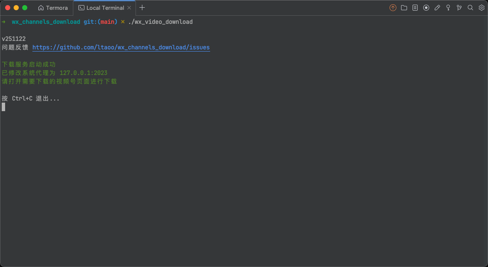
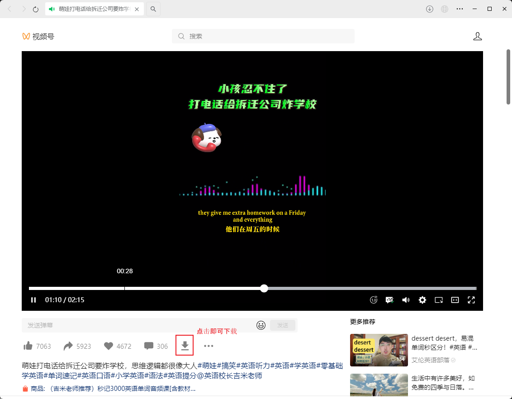
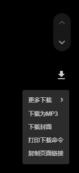
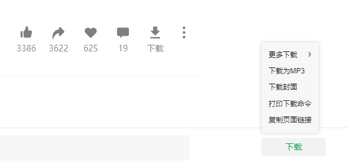
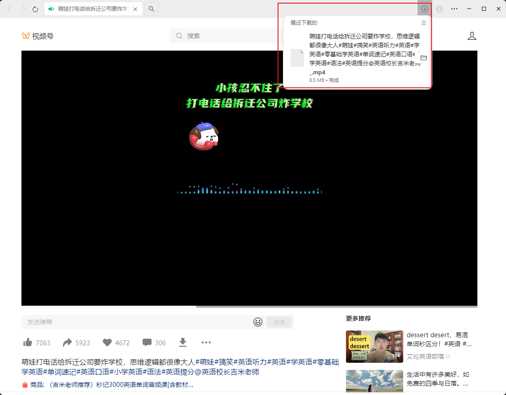
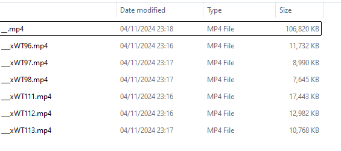

# 微信视频号下载器

体积小、使用简单、支持 macOS 和 Windows 系统。

## 使用说明

下载[构建包](https://github.com/ltaoo/wx_channels_download/releases)，**以管理员身份运行**，首次打开会自动安装证书，然后启动服务。

当终端提示「代理服务启动成功」就说明可以使用了。



> 已安装证书会跳过安装证书步骤。

打开微信 PC 端，点击需要下载的视频，在视频下方的操作按钮一栏，会多出一个下载按钮，如下所示



如果没有，在页面侧边或底部会有悬浮按钮，拥有相同的功能

| 首页推荐 | 视频详情页 |
| --- | --- |
|  |  |


等待视频开始播放，然后暂停视频，点击下载按扭即可下载视频。下载成功后，会在上方显示已下载的文件，下载文件名最后面会标志该视频质量。



下载按钮默认会下载视频号默认质量的视频（即当前播放的视频，一般都是体积最小的），可以在下拉菜单下载其他质量的视频
<br>
不同视频这里显示的选项是不同的，没有找到对 xWT111 具体的说明，属于什么分辨率、尺寸多大等等。
<br>
经过测试，如果原始视频有 104MB，这里尺寸最大的是 xWT111 为 17MB，最小的是 xWT98 为 7MB。



仅供参考。


## 开发说明

先以 管理员身份 启动终端，然后 `go run main.go` 即可。

## 打包

### windows

```bash
go build -ldflags="-s -w"
```

打包后可以使用 `upx` 压缩，进一步减小体积

```bash
upx wx_channel
```

#### macOS 交叉编译 Windows

```bash
CGO_ENABLED=0 GOOS=windows GOARCH=amd64 go build -trimpath -ldflags="-s -w" -o wx_video_download_windows_x86_64.exe
```

#### Windows SunnyNet 版本（需要 Docker）

SunnyNet 版本需要 CGO 和 MinGW 交叉编译，在 macOS 上需要使用 Docker 构建：

```bash
# 1. 生成 vendor 目录
go mod vendor

# 2. 使用 Docker 构建
docker run --rm \
  -v "$(pwd):/workspace" \
  -w /workspace \
  golang:1.20 \
  bash -c '
    apt-get update && apt-get install -y gcc-mingw-w64 g++-mingw-w64

    # 应用 SunnyNet 补丁（修复 MinGW 兼容性问题）
    SUNNYNET_DIR="vendor/github.com/qtgolang/SunnyNet"
    mv $SUNNYNET_DIR/src/ProcessDrv/Proxifier/proxifier.hpp $SUNNYNET_DIR/src/ProcessDrv/Proxifier/Proxifier.hpp
    sed -i "s/typedef struct _MIB_TCPROW2 {/typedef struct _MIB_TCPROW2_CUSTOM {/" $SUNNYNET_DIR/src/iphlpapi/c_iphlpapi_tcp.h
    sed -i "s/} MIB_TCPROW2, \*PMIB_TCPROW2;/} MIB_TCPROW2_CUSTOM, *PMIB_TCPROW2_CUSTOM;/" $SUNNYNET_DIR/src/iphlpapi/c_iphlpapi_tcp.h
    sed -i "s/typedef struct _MIB_TCPTABLE2 {/typedef struct _MIB_TCPTABLE2_CUSTOM {/" $SUNNYNET_DIR/src/iphlpapi/c_iphlpapi_tcp.h
    sed -i "s/MIB_TCPROW2 table\[ANY_SIZE\];/MIB_TCPROW2_CUSTOM table[ANY_SIZE];/" $SUNNYNET_DIR/src/iphlpapi/c_iphlpapi_tcp.h
    sed -i "s/} MIB_TCPTABLE2, \*PMIB_TCPTABLE2;/} MIB_TCPTABLE2_CUSTOM, *PMIB_TCPTABLE2_CUSTOM;/" $SUNNYNET_DIR/src/iphlpapi/c_iphlpapi_tcp.h
    sed -i "s/typedef DWORD (WINAPI \* GetTcpTable2)(PMIB_TCPTABLE2 TcpTable, PULONG SizePointer, BOOL Order);/typedef DWORD (WINAPI * GetTcpTable2_CUSTOM)(PMIB_TCPTABLE2_CUSTOM TcpTable, PULONG SizePointer, BOOL Order);/" $SUNNYNET_DIR/src/iphlpapi/c_iphlpapi_tcp.h
    sed -i "s/GetTcpTable2 pGetTcpTable2;/GetTcpTable2_CUSTOM pGetTcpTable2;/" $SUNNYNET_DIR/src/iphlpapi/c_iphlpapi_tcp.c
    sed -i "s/(GetTcpTable2)/(GetTcpTable2_CUSTOM)/g" $SUNNYNET_DIR/src/iphlpapi/c_iphlpapi_tcp.c
    sed -i "s/(PMIB_TCPTABLE2)/(PMIB_TCPTABLE2_CUSTOM)/g" $SUNNYNET_DIR/src/iphlpapi/c_iphlpapi_tcp.c
    sed -i "s/PMIB_TCPTABLE2 pTcpTable;/PMIB_TCPTABLE2_CUSTOM pTcpTable;/" $SUNNYNET_DIR/src/iphlpapi/c_iphlpapi_tcp.c
    sed -i "s/PMIB_TCPTABLE2 tcpTable/PMIB_TCPTABLE2_CUSTOM tcpTable/g" $SUNNYNET_DIR/src/iphlpapi/c_iphlpapi_tcp.c
    sed -i "s/pTcpTable = (MIB_TCPTABLE2\*)/pTcpTable = (MIB_TCPTABLE2_CUSTOM*)/g" $SUNNYNET_DIR/src/iphlpapi/c_iphlpapi_tcp.c
    sed -i "s/tcpTable = (MIB_TCPTABLE2\*)/tcpTable = (MIB_TCPTABLE2_CUSTOM*)/g" $SUNNYNET_DIR/src/iphlpapi/c_iphlpapi_tcp.c
    sed -i "s/MIB_TCPROW2 \*row/MIB_TCPROW2_CUSTOM *row/g" $SUNNYNET_DIR/src/iphlpapi/c_iphlpapi_tcp.c

    # 构建
    CGO_ENABLED=1 CC=x86_64-w64-mingw32-gcc CXX=x86_64-w64-mingw32-g++ \
    GOOS=windows GOARCH=amd64 \
    go build -mod=vendor -tags sunnynet -ldflags "-s -w -extldflags \"-static\"" \
    -o wx_video_download_sunnynet.exe .
  '
```

### macOS

```bash
CGO_ENABLED=1 GOOS=darwin SDKROOT=$(xcrun --sdk macosx --show-sdk-path) go build -trimpath -ldflags="-s -w" -o wx_video_download
```

```bash
CGO_ENABLED=1 GOOS=darwin GOARCH=amd64 SDKROOT=$(xcrun --sdk macosx --show-sdk-path) go build -trimpath -ldflags="-s -w" -o wx_video_download
```
 
### Linux

```bash
CGO_ENABLED=0 GOOS=linux GOARCH=amd64 go build -trimpath -ldflags="-s -w" -o wx_video_download

$env:CGO_ENABLED=0; $env:GOOS="linux"; $env:GOARCH="amd64"; go build -trimpath -ldflags="-s -w" -o wx_video_download

upx --best --lzma wx_video_download
```

```bash
CGO_ENABLED=0 GOOS=linux GOARCH=arm64 go build -trimpath -ldflags="-s -w" -o wx_video_download
```

## 感谢

前端解密部分参考自
<br>
https://github.com/kanadeblisst00/WechatVideoSniffer2.0
<br>

后端解密代码来自
<br>
https://github.com/Hanson/WechatSphDecrypt


## ⚠️ 免责声明

```text
本项目为开源项目
仅用于技术交流学习和研究的目的
请遵守法律法规,请勿用作任何非法用途
否则造成一切后果自负
若您下载并使用即视为您知晓并同意
```
