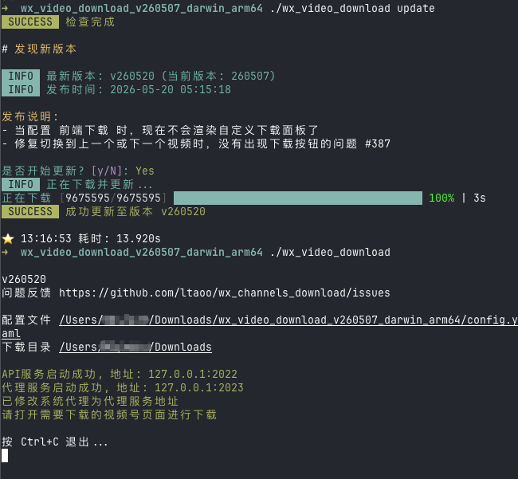

# 更新

用于检查是否有新版本，并下载更新到最新版本。

## 用法

```sh
wx_video_download update
```

## 说明

- 程序会自动从 GitHub Releases 拉取最新版本信息，并与当前版本进行比较。
- 如果当前已是最新版本，会直接提示并退出。
- 如果发现新版本，会展示版本号、发布时间和发布说明，确认后开始下载更新。
- 下载完成后会自动替换当前程序文件，更新即刻生效。


