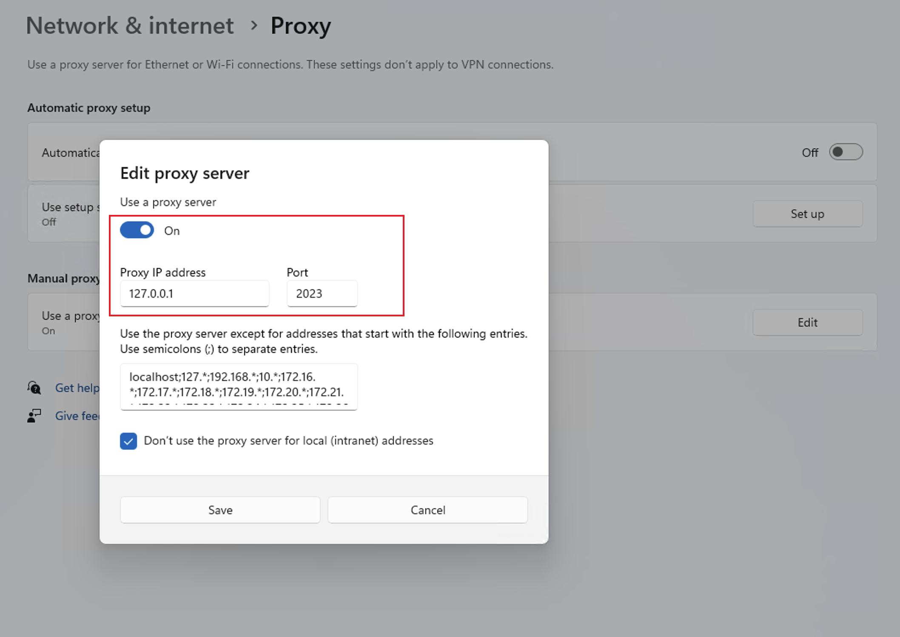
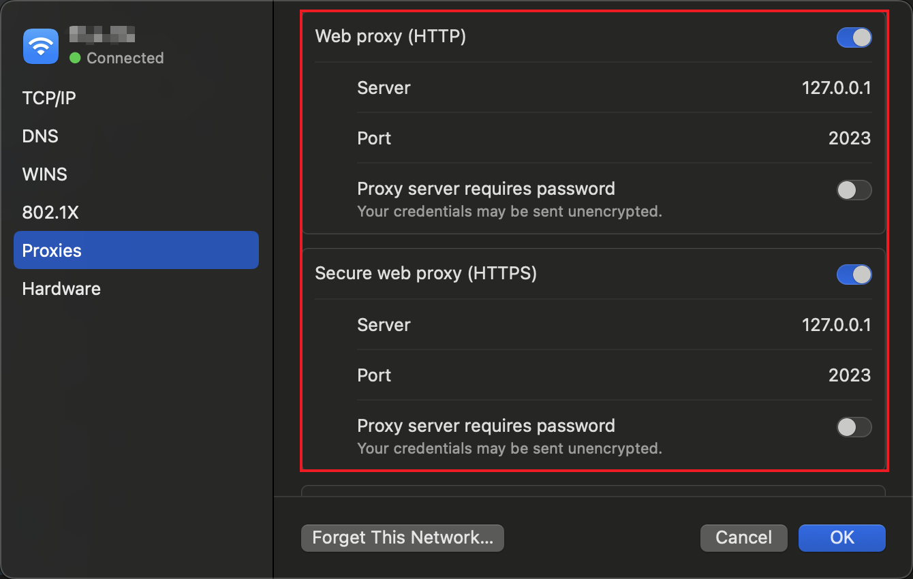

# 没有下载按钮

## 排查步骤

- 确认下载器已启动
- 确认系统代理设置成功
- 若配置不使用系统代理，请使用 Clash 等软件，视频号请求转发到端口 `127.0.0.1:2023`
- 刷新页面或重新进入视频详情页
- 升级到最新版本后重试。

## 确认系统代理设置成功

如果打开视频号没有下载按钮请先检查系统代理是否如下所示

### win 系统

### macOS 系统

