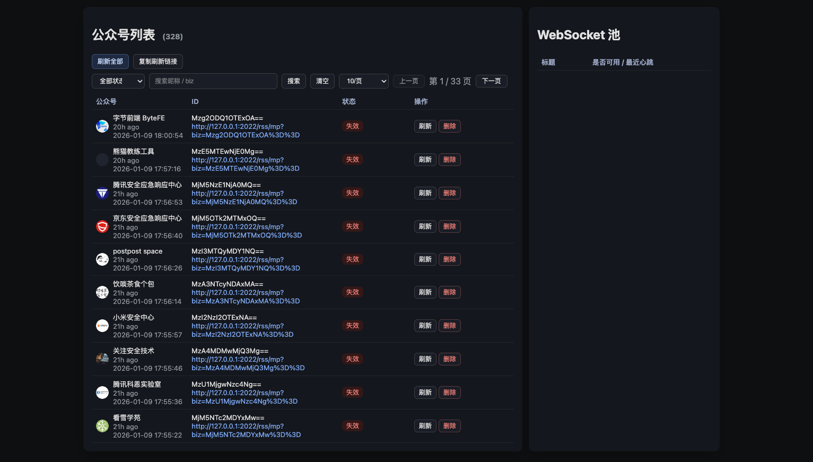
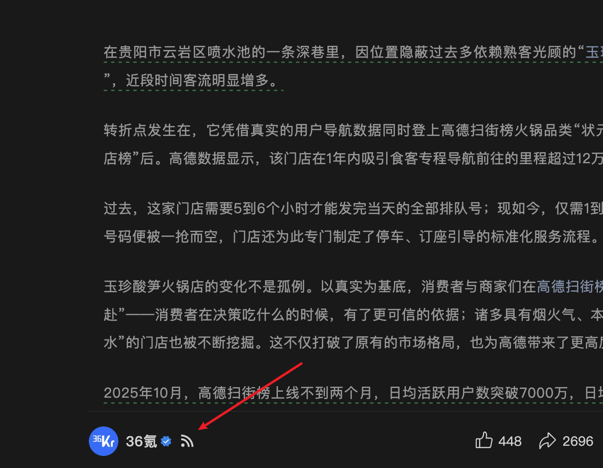

# 微信公众号 RSS

目前处于 Beta 阶段，有如下功能

- 本地通过代理服务，在打开公众号页面时，自动添加该公众号
- 本地提供 <code v-pre>http://127.0.0.1:2022/mp/home</code> 页面，可以管理添加的公众号
  
- 提供 <code v-pre>{{APIServerAddr}}/rss/mp</code> 接口，用于订阅指定公众号
- 提供 `deploy` 命令，用于部署到 `Cloudflare Workers`
- 提供 `mp` 命令，用于在 `linux` 服务器上运行，仅包含 `API` 和 `RSS` 服务

## 原理说明

访问公众号文章页面时，可以获取到该公众号的一些参数，包括 `biz`、`key` 和 `pass_ticket`，使用这些参数（下面称为授权凭证），可以调用微信公众号的接口，获取到该公众号的推送消息列表。

但是授权凭证，30 分钟 就失效了，所以需要定时再通过访问公众号文章页面重新获取

## 使用方式

下面的步骤，都是为了可以在公网上使用 `RSS` 能力

**仍需要 macOS 或 Windows 机器，用于同步「授权凭证」到远端服务**

### cloudflare

在 `config.yaml` 中，配置好 `cloudflare` 的配置项

```yaml
cloudflare:
  accountId: ""
  apiToken: ""
  refreshToken: "refresh_token"
  adminToken: "admin_token"
  workerName: "mp-rss-api"
  d1Name: "mp-rss-db"
```

其中 `accountId` 可以登录后查看地址，域名后面 32 长度的，字母+数字的字符串就是 `accountId`。`apiToken` 可以在 `Cloudflare` 登录后，点击 `Profile` -> `API Tokens` 查看。

https://dash.cloudflare.com/profile/api-tokens

`api token` 必须包含 `worker` 的查看、编辑权限，和 `d1` 的查看、编辑权限，否则会报错

其中 `refreshToken` 用于「本地」向「远端服务」提交「授权凭证」时的校验，可以避免被无授权的人修改公众号授权凭证，导致服务不可用

上述配置完成后，执行下面命令即可部署到 `Cloudflare`

```bash
./wx_channels_download deploy
```

### 本地刷新配置

完成后，继续修改配置

```yaml
mp:
  remoteServer:
    protocol: "https"
    hostname: "mp-rss-api.xx.workers.dev" # 这里填部署好的 cloudflare worker 访问域名
    port: 80
  refreshToken: "refresh_token" # 这里填 cloudflare worker 配置的 refreshToken
```

完成后，启动 `wx_channels_download`，然后，打开**任意公众号文章页面**，可以在下方看到 `RSS` 按钮



> 如果没有，手动刷新一下页面即可

点击即可复制该公众号 RSS 订阅链接，在浏览器打开该链接，即可看到 `XML` 格式的订阅内容

> 在浏览器打开时，如果提示 `Account not found`，就是没有添加成功，给终端设置科学上网后，重新启动 `wx_channels_download`、打开公众号文章页面刷新即可

> 可以查看本地的 `app.log`，如果出现 `push credential to remote server: request failed` 内容，就是提交到 `cloudflare worker` 失败了

至此，整个流程就完成了

### 公众号管理

在 <code>http://127.0.0.1:2022/mp/home</code> 页面，可以管理添加的公众号。当公众号授权凭证过期，在页面上会显示「失效」，在有公众号文章页面打开的状态下后，在 `/mp/home` 页面点击「刷新」即可重新获取授权凭证，该凭证会同步提交到部署的 `cloudflare worker`

### 部署到 linux 服务

和 `cloudflare worker` 一样，仅提供 `API` 和 `RSS` 服务。但是相比 `cloudflare worker` 支持更多能力

下载构建包到 `linux` 服务器，修改配置文件

```yaml
# config.yaml
mp:
  refreshToken: "123"
  tokenFilepath: ""
```

`tokenFilepath` 指定调用 `API` 或 `RSS` 时的授权凭证文件，可以留空。或者指定一个 `./token.txt`，那么会读取该文件，每行作为一个 `token`，调用接口时必须传入 `&token=`，否则会拒绝访问。

使用 `chmod +x ./wx_video_download` 给二进制文件添加权限，然后运行命令 `./wx_video_download mp -d` 启动，该命令仅运行公众号相关的功能，且作为守护进程运行

同样，修改本地配置文件，用于向远端服务提交授权凭证

```yaml
# config.yaml
mp:
  remoteServer:
    protocol: "https"
    hostname: "rss.example.com"
    port: 80
  refreshToken: "123"
```

`linux` 上部署的服务，可以打开 `rss.example.com/mp/home` 查看公众号列表，并且可以查看公众号是否可用。

更多命令可以参考 [命令行工具](../cli/mp.md)

## API

## 获取指定公众号消息列表

```bash
curl http://localhost:2022/api/mp/msg/list?biz=MzI2NDk5NzA0Mw==
```

通过 `offset` 指定偏移量，可以获取到更多的消息记录

```bash
curl http://localhost:2022/api/mp/msg/list?biz=MzI2NDk5NzA0Mw==&offset=10
```

## 获取添加的公众号列表

```bash
curl http://localhost:2022/api/mp/list
```


## 公众号 RSS

```bash
curl http://localhost:2022/rss/mp?biz=MzI2NDk5NzA0Mw==
```

同样可以传入 `offset` 获取到更多消息记录。

还提供 `proxy` 和 `content` 参数，分别用于代理公众号内容和默认获取公众号文章全文

### proxy

> 仅在 `linux` 部署的服务上支持

如果阅读器提供获取全文能力，但是无法正确获取到公众号文章正文，可以指定 `proxy=1`，那么返回文章列表中，文章链接都会添加 <code>{{APIServerAddr}}/mp/proxy</code> 前缀，当打开文章时，将使用代理代为请求微信公众号返回正文内容

### proxy_cover

> 仅在 `linux` 部署的服务上支持

相比 `proxy`，`proxy_cover` 仅代理封面图片，可以用在仅需查看列表，点击跳转到原文的场景

### content

> 仅在 `linux` 部署的服务上支持

如果希望直接获取到正文，可以指定 `content=1`，那么请求 `RSS` 接口时，就会同时获取正文。但是缺点就是列表接口会比较慢（因为要依次请求到正文）

## 注意事项

### 推送消息列表接口风控

调用推送消息列表接口会有频率限制，所以不能添加太多的公众号。经过测试 300 个公众号，每 20 分钟重新获取授权凭证，3 个小时后帐号被风控，无法获取推送消息列表了，但是微信本身还是可以正常使用，包括公众号功能也是正常的，不影响

基于上面的风险，现在限制只能添加 20 个公众号。可以自己修改源码放开限制，风险自己把控。

### 授权凭证

授权凭证中，只有 `biz` 和 `uin` 是不变的，`biz` 是公众号唯一标记，`uin` 微信用户（你自己）的唯一标记，所以 `mp.remoteServer` 里面不要填非自己的服务，避免别人拿到 `uin`，疯狂调用推送消息列表接口，被微信风控，自己没法用了

