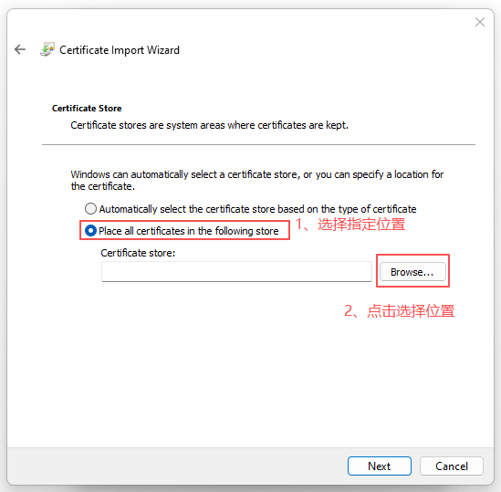
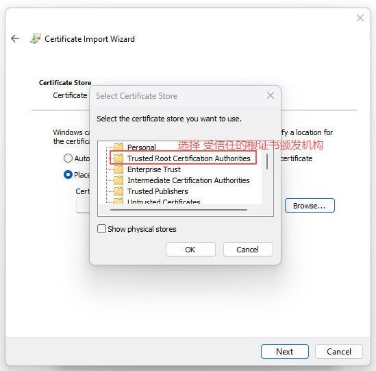
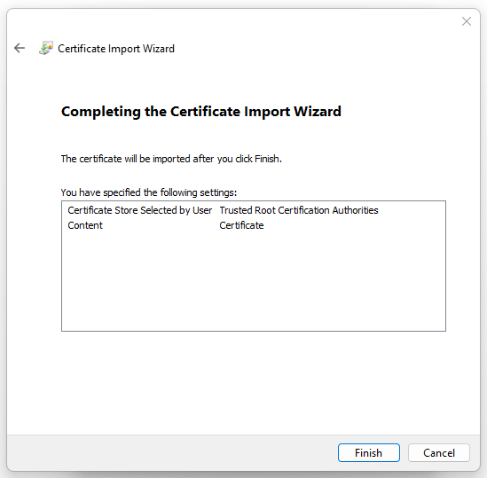
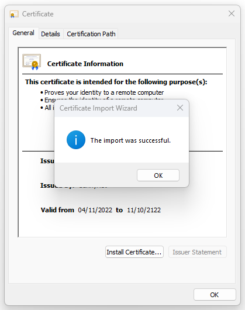
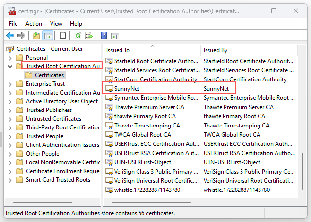
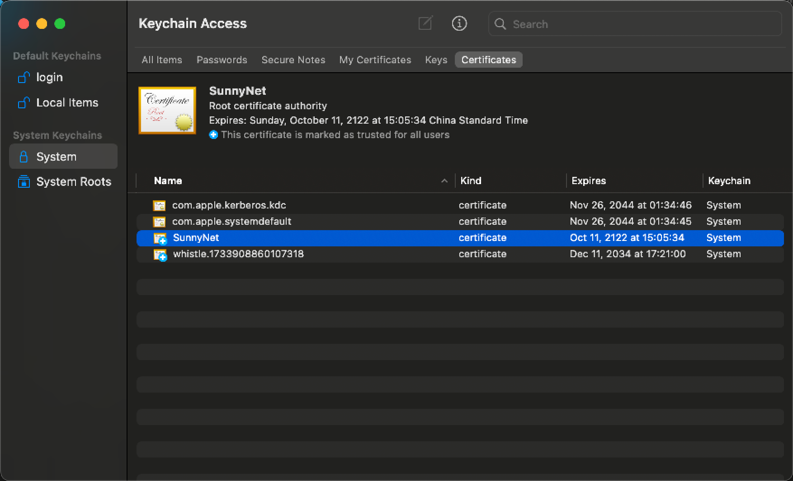

# 手动安装根证书

安装根证书的目的是拦截并修改视频号响应，从而实现插入下载按钮。当自动安装失败时，可以参考该文档手动安装根证书

> 安装根证书会影响系统的全局信任链，请仅在充分信任的前提下进行。如果担心根证书风险，可以安装自己的根证书。参考 [证书配置](../config/cert.md)

### 下载安装

<a href="/SunnyRoot.cer" download>点击下载 SunnyRoot.cer</a>  

## Windows
- 下载根证书文件并双击打开
- 按向导选择“本地计算机”，并安装到“受信任的根证书颁发机构”
- 也可通过 MMC 管理单元手动导入

查看是否安装成功

## macOS
- 双击下载的 `SunnyRoot.cer` 打开“钥匙串访问”
- 选择添加到“系统”钥匙串，并设置“始终信任”
双击 `SunnyRoot.cer` 打开“钥匙串访问”

在左上角选择“系统”钥匙串，将证书添加到系统钥匙串

双击证书，展开“信任”，将“使用此证书时”设为“始终信任”，关闭窗口后输入管理员密码保存

