# 手动安装根证书

安装根证书的目的是拦截并修改视频号响应，从而实现插入下载按钮。当自动安装失败时，可以参考该文档手动安装根证书

> 安装根证书会影响系统的全局信任链，请仅在充分信任的前提下进行。如果担心根证书风险，可以安装自己的根证书。参考 [证书配置](../config/cert.md)

### 下载安装

<a href="/SunnyRoot.cer" download>点击下载 SunnyRoot.cer</a>  


## Windows
- 下载根证书文件并双击打开
- 按向导选择“本地计算机”，并安装到“受信任的根证书颁发机构”
- 也可通过 MMC 管理单元手动导入

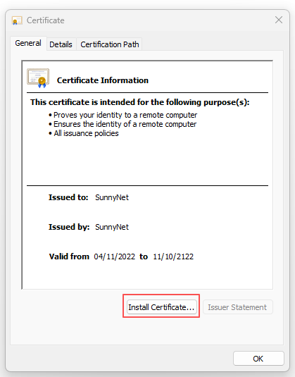
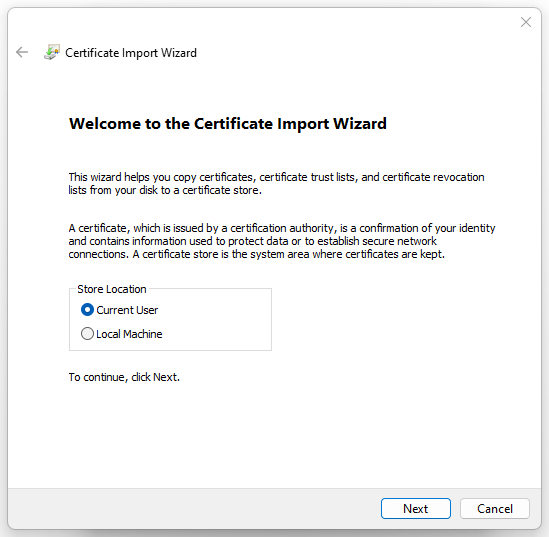
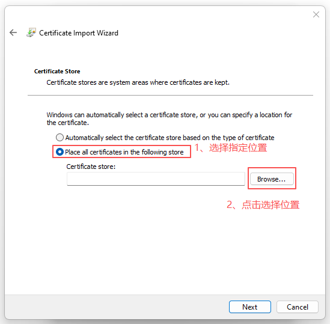
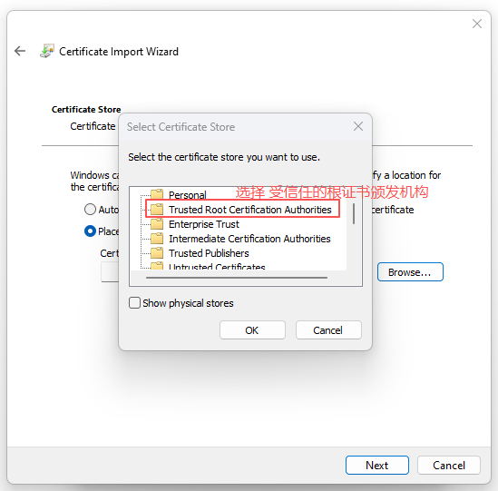
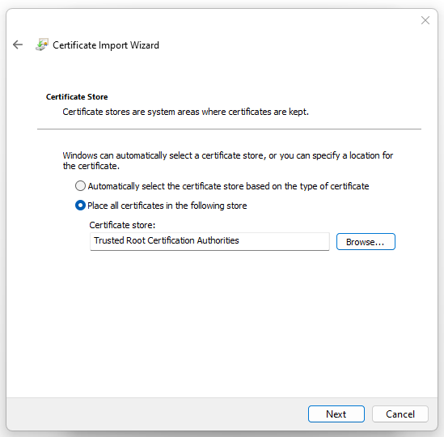
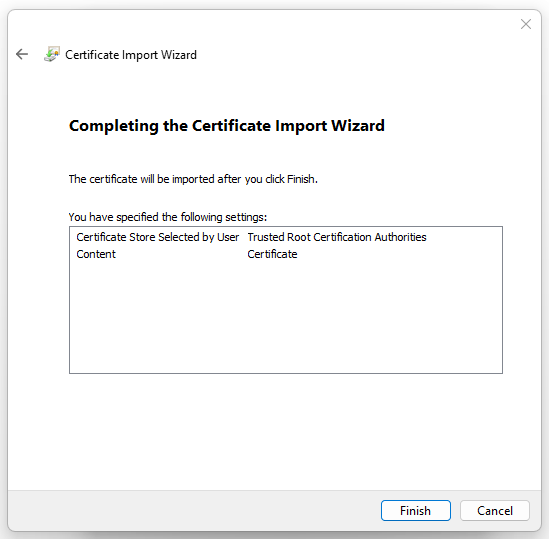
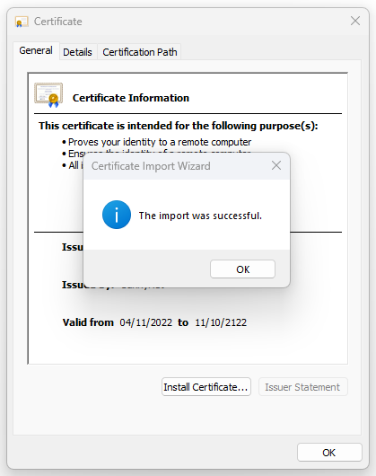

查看是否安装成功

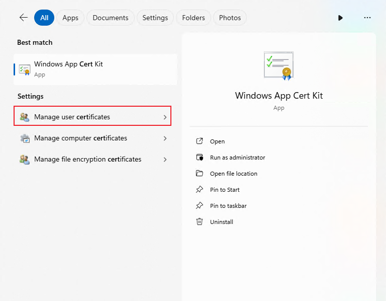
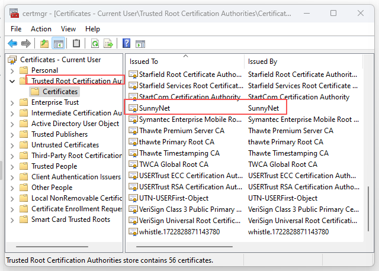
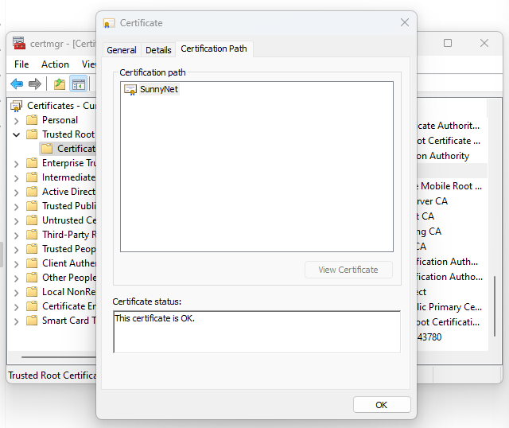

## macOS
- 双击下载的 `SunnyRoot.cer` 打开“钥匙串访问”
- 选择添加到“系统”钥匙串，并设置“始终信任”
双击 `SunnyRoot.cer` 打开“钥匙串访问”

在左上角选择“系统”钥匙串，将证书添加到系统钥匙串

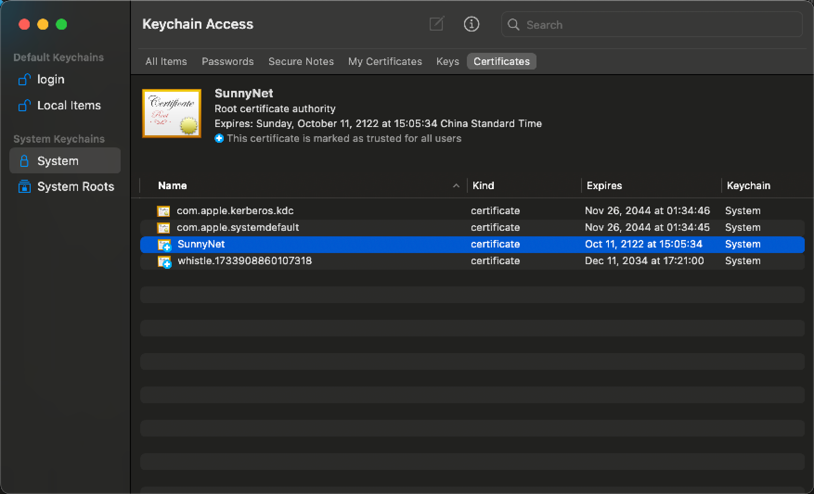
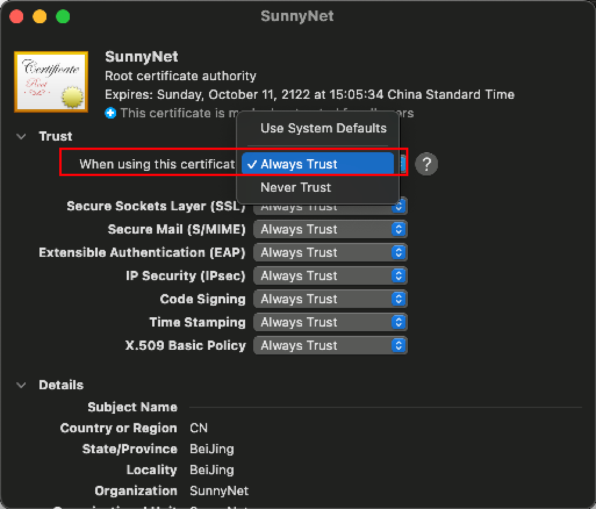

双击证书，展开“信任”，将“使用此证书时”设为“始终信任”，关闭窗口后输入管理员密码保存

## Linux

下载 `SunnyRoot.cer` 后，根据发行版选择对应命令安装到系统根证书库。

### Debian / Ubuntu

```bash
sudo mkdir -p /usr/local/share/ca-certificates
sudo install -m 0644 ~/Downloads/SunnyRoot.cer /usr/local/share/ca-certificates/WeChatAppEx_CA.crt
sudo update-ca-certificates --fresh
```

### Fedora / RHEL / CentOS

```bash
sudo mkdir -p /etc/pki/ca-trust/source/anchors
sudo install -m 0644 ~/Downloads/SunnyRoot.cer /etc/pki/ca-trust/source/anchors/WeChatAppEx_CA.crt
sudo update-ca-trust extract
```

### Arch / Manjaro

```bash
sudo mkdir -p /etc/ca-certificates/trust-source/anchors
sudo install -m 0644 ~/Downloads/SunnyRoot.cer /etc/ca-certificates/trust-source/anchors/WeChatAppEx_CA.crt
sudo trust extract-compat
```

安装后重启微信和下载器。如果浏览器、Chromium/Electron 应用仍然提示证书不受信任，可以额外写入当前用户的 NSS 证书库：

```bash
mkdir -p ~/.pki/nssdb
[ -f ~/.pki/nssdb/cert9.db ] || certutil -d sql:$HOME/.pki/nssdb -N --empty-password
certutil -d sql:$HOME/.pki/nssdb -D -n WeChatAppEx_CA 2>/dev/null || true
certutil -d sql:$HOME/.pki/nssdb -A -n WeChatAppEx_CA -t "CT,C,C" -i ~/Downloads/SunnyRoot.cer
```

`certutil` 命令由 `libnss3-tools`（Debian / Ubuntu）或 `nss-tools`（Fedora / RHEL / CentOS）提供，Arch / Manjaro 可安装 `nss`。
