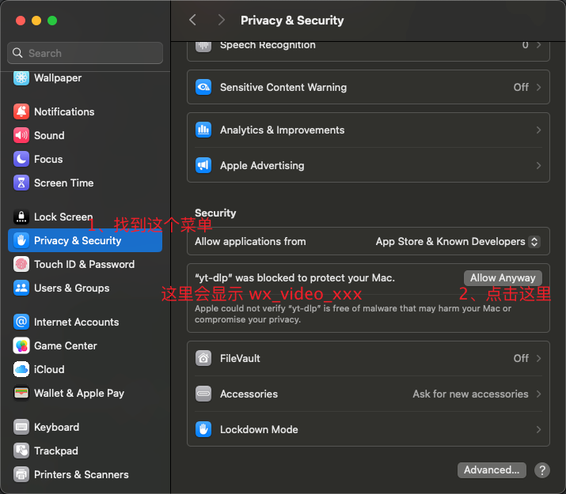
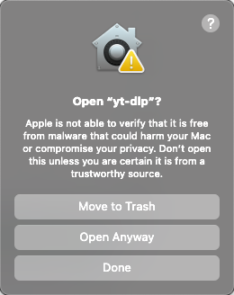

# 下载

<br />

<ClientOnly>
<div class="mt-8">
<EnvInfo />
</div>
</ClientOnly>

下载对应平台的构建包：<https://github.com/ltaoo/wx_channels_download/releases>


## 如何选择构建包

根据上述环境信息，选择对应的构建包

1. macOS arm64
选择 darwin_arm64 后缀

2. macOS x86_64
选择 darwin_x86_64 后缀

3. Windows x86_64
选择 windows_x86_64 后缀

4. Linux x86_64
选择 linux_x86_64 后缀

5. Linux arm64
选择 linux_arm64 后缀

> windows 平台有带 `safe` 标记的文件，表示「没有使用UPX压缩来减小体积」，在某些电脑上，可以避免被识别为病毒

## 运行下载器

### Windows

在 `Windows` 平台，解压后双击直接运行 `wx_video_download.exe` 即可，首次使用会自动安装证书并设置系统代理。

### macOS

> 自 251213 之后，会对 `wx_video_download` 进行签名和公证，以避免 macOS 提示「文件不能打开」。但由于无法对二进制文件「钉证」，双击打开还会触发 `Gatekeeper` 保护，需要手动确认才能运行。

> 但是通过命令行运行就完全不会触发任何的校验。

> 260502 之后证书失效，需要完整按下面步骤执行。

**首次打开需要使用 `sudo ./wx_video_download` 运行一次，后续双击打开即可。**

如果有问题，按照下面步骤进行。

#### 赋予执行权限

```sh
chmod +x ./wx_video_download
```

#### 以管理员身份运行

```sh
sudo ./wx_video_download
```

#### 允许来自未知来源的应用

若系统提示「文件不能打开」，在系统设置中允许来自未签名开发者的应用。



再次执行 `./wx_video_download`，可能出现下面窗口，选择 `Open Anyway`。



只有首次打开需要经历上述步骤，之后可直接双击 `wx_video_download` 运行，无需繁琐步骤。

### Linux

在 `Linux` 平台，下载对应的 `linux` 构建包并解压后，先赋予执行权限：

```bash
chmod +x ./wx_video_download
```

然后修改同目录下的 `config.yaml`，启用 TUN 模式：

```yaml
proxy:
  tun: true
```

TUN 模式需要管理员权限，启动时请使用：

```bash
sudo ./wx_video_download
```

启动成功后，打开微信中的视频号页面即可下载。
