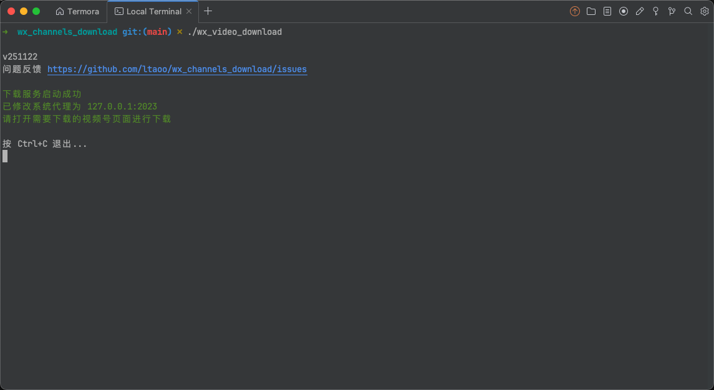

# 使用步骤

当下载器启用成功后，终端内容如下

此时可以打开视频号页面正常下载了

## 视频号详情页

左侧是视频，下面有操作按钮，右侧是推荐，这种页面即「视频号详情页」。默认会在操作按钮一栏插入下载按钮，点击即可下载

> 当前仅在视频号详情页支持「更多」菜单，可以下载不同规格的视频，可以打印下载命令。可以通过右上角「个人」->「浏览记录」进入该页面

## 视频号首页

现在默认的视频播放页

同样有下载按钮，同样点击即可下载视频。

