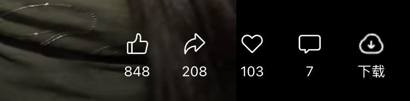
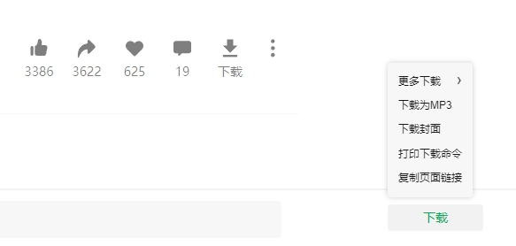

# 使用步骤

当下载器运行成功后，终端内容如下

此时可以打开视频号页面正常下载了

## 视频号详情页

左侧是视频，下面有操作按钮，右侧是推荐，这种页面即「视频号详情页」。默认会在操作按钮一栏插入下载按钮，点击即可下载

> 当前仅在视频号详情页支持「更多」菜单，可以下载不同规格的视频，可以打印下载命令。可以通过右上角「个人」->「浏览记录」进入该页面

## 视频号首页

即点击微信侧边「视频号」进入的页面，以及某些版本从「文件助手」打开视频号时，会自动跳转至首页。

视频下方的操作栏，同样有下载按钮，点击即可下载视频。

## 兜底按钮

上面的按钮依赖页面上特定的位置，如果视频号有改版，就会出现无法正确插入下载按钮，这种情况下会直接在页面上插入下载按钮

| 首页推荐 | 视频详情页 |
| --- | --- |
|  |  |
