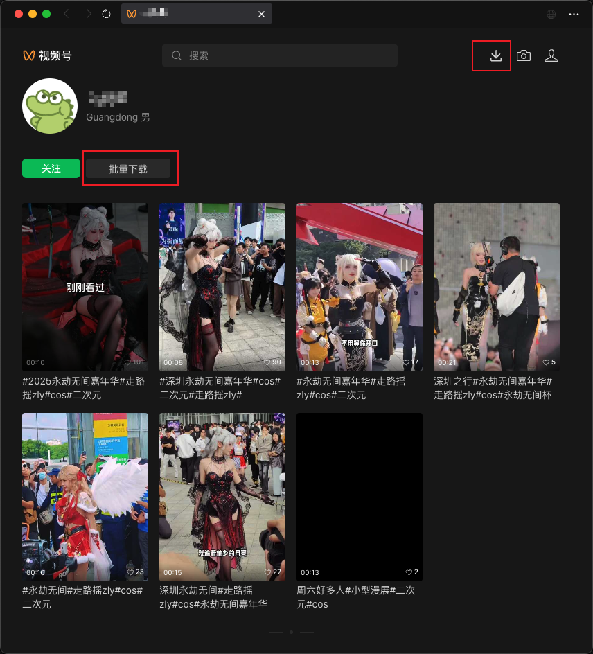
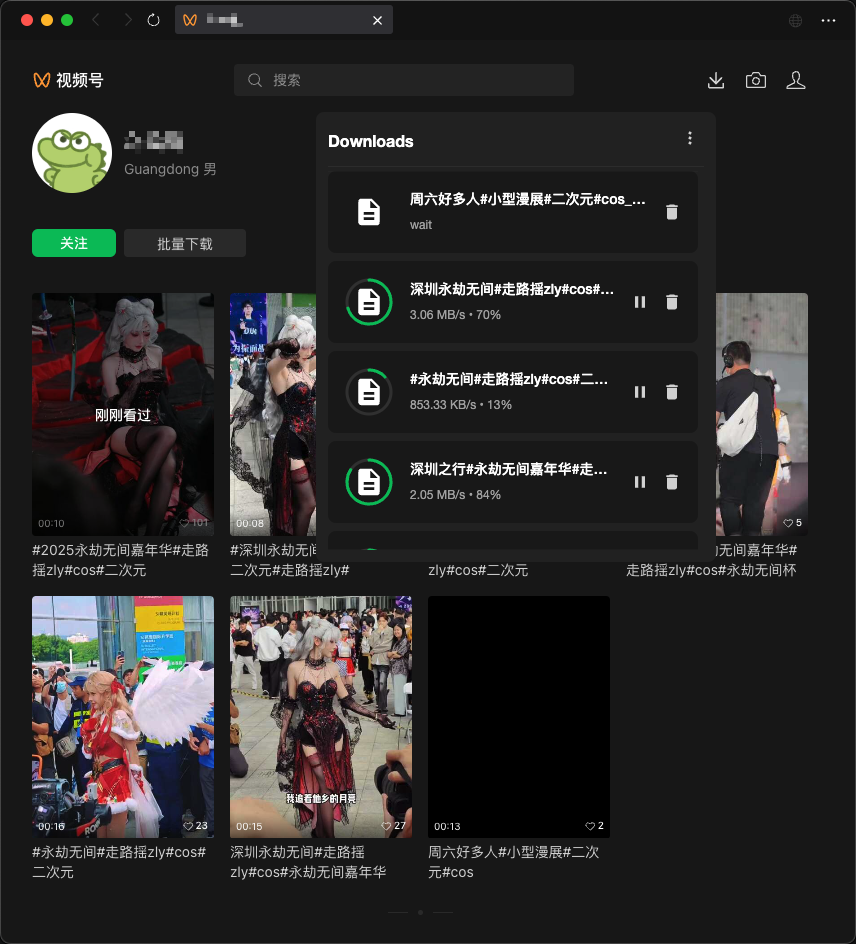

# v251226

现在支持批量下载指定帐号的所有视频了，下载能力由 [gopeed](https://github.com/GopeedLab/gopeed) 提供

## 更新内容

- 修复了在详情页点击侧边视频，会重复插入下载按钮的问题
- 支持在帐号详情页批量下载视频
- 默认在后台下载视频
- 后台下载模式下支持指定下载目录
- 后台下载模式下文件名支持生成目录
- 移除了下载中转服务是否启用的配置

## 批量下载

| 批量下载按钮                                      | 下载列表                                      |
| ------------------------------------------------- | --------------------------------------------- |
|  |  |

## 后台下载

之前下载、解密都是在前端，下载长视频经常会中断，而且会阻塞前端页面操作，现在点击「下载」默认是在后台下载了。并且刷新页面不会中断下载，退出下载器后会中断所有下载任务。

重新启动后，需要手动开始暂停的下载任务。

如果不需要后台下载，可以在配置文件中指定在前端下载

- [前端下载](../config/download.md#前端下载)

### 文件名支持生成目录

在配置文件 `filenameTemplate`，可以使用 <code v-pre>{{author}}</code> 来表示视频作者的名称，增加 `/` 符号，例如 <code v-pre>{{author}}/{{filename}}_{{spec}}</code>，这样下载的文件会放在以作者名为目录的目录中。

- [下载时的文件名称](../config/download.md#下载时的文件名称)
